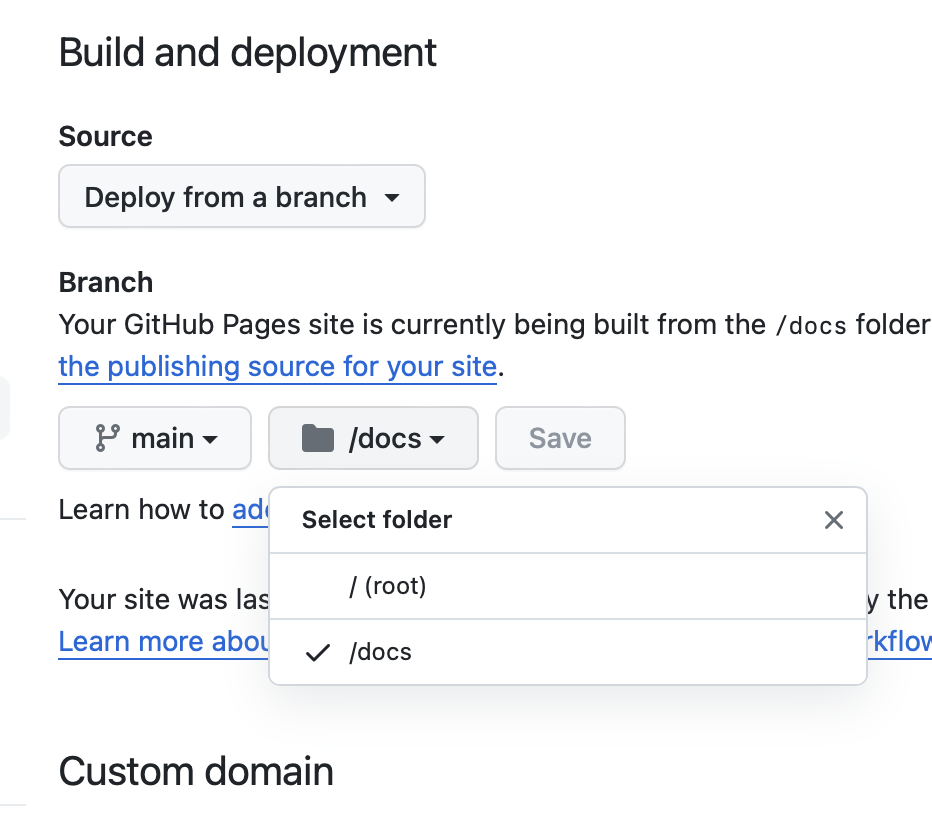

# Host your static webpages using Github Pages.

1. index.html
    - hackerrank dashboard - https://www.hackerrank.com/dashboard
2. page02.html
    - signup page - https://www.hackerrank.com/skills-verification
3. page03.html
    - profile page - https://www.hackerrank.com/auth/login

#### [Click here to view the github page](https://industry-ready-2125.github.io/module-3-hosting-KLN-loki/)

## Steps 

### #1
Copy 3 or more static web pages that you created in 2nd assignment to `docs` folder.

### #2
Using `GitHub Pages` publish the website and use `docs` folder to be used for publishing the website.  

Select `docs` folder as shown in the image, in GitHub pages.
 

